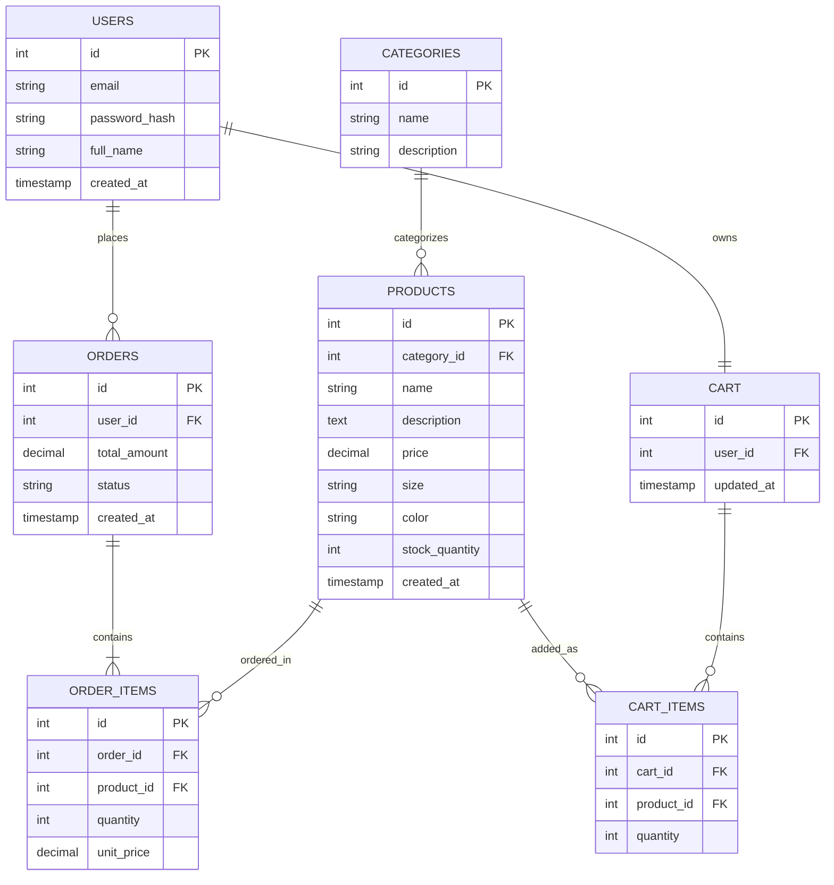

# E-Commerce Project - Sprint 1
---

## 1. Target Audience & Market Focus

**- Primary Persona:**
Retail consumers aged 18–40 shopping for everyday and casual clothing online students and young professionals who want a simple, fast browsing/checkout experience with clear sizing and category navigation, rather than a cluttered multi-vendor marketplace.

**- Core Pain Point:**
Many small-to-mid apparel sellers either rely on expensive third-party marketplace fees or run sales manually through social media, with no proper cart, size/variant tracking, or order history for customers. Buyers, in turn, often struggle with unclear stock/size availability and clunky checkout flows on smaller apparel sites.

**- Domain Scope:**
Vertical market: **Apparel / Clothing** — covering categories such as Men's Wear, Women's Wear, Footwear, and Accessories, with product variants by size and color.

---

## 2. Minimum Viable Product (MVP) Feature Scope

| Category | Feature Name | Description | Priority |
|---|---|---|---|
| Authentication | User Registration & Authentication | Password hashing (bcrypt) and JWT-based session authentication for buyers. | High (MVP) |
| Catalog | Product List & Search | Product browsing with category (Men/Women/Footwear/Accessories) and size/color filtering. | High (MVP) |
| Cart | Cart Management | Persistent cart state (add, update quantity/size, remove items) tied to the logged-in user. | High (MVP) |
| Checkout | Order Processing | Mock payment gateway integration; creates an Order and associated Order_Items on confirmation. | High (MVP) |
| Admin | Inventory Control | Admin-only CRUD for products, including size/color variants and per-variant stock. | Medium |
| Account | Order History | Buyers can view their past orders and order status. | Medium |

---

## 3. Tech Stack Selection & Justification

- **Frontend Framework: React (with Vite)**
  Justification: React's component model fits a catalog/cart/checkout UI well, has the largest ecosystem for UI libraries and state management, and Vite keeps local dev/build times fast for iterative sprint work.A lighter setup than Next.js since server-side rendering/SEO isn't a grading priority here.

- **Backend Infrastructure: Node.js / Express**
  Justification: Express is minimal and unopinionated, which keeps the learning curve low for a solo project, integrates naturally with a JS-based frontend (shared language, shared JSON contracts), and has mature libraries for JWT auth and Stripe mock integration.

- **Database Management System: PostgreSQL**
  Justification: The domain (Users, Orders, Order_Items, Products, Categories) is inherently relational with strict foreign-key constraints and transactional integrity requirements (e.g., an order must atomically reference valid products and quantities), this favors PostgreSQL's ACID guarantees over a schema-less NoSQL store like MongoDB.

- **Caching & Asynchronous Processing (Optional): Redis**
  Justification: Redis will be used to store cart session data for fast reads/writes and, later, to queue order-confirmation emails asynchronously so checkout requests aren't blocked by email sending.

---

## 4. Entity-Relationship Diagram (ERD)

**Structural notes:**
- `USERS (1) — (N) ORDERS`: one user can place many orders.
- `ORDERS (1) — (N) ORDER_ITEMS`: one order contains many line items.
- `PRODUCTS (1) — (N) ORDER_ITEMS`: one product can appear in many order line items (N:M between Orders and Products, resolved via Order_Items).
- `CATEGORIES (1) — (N) PRODUCTS`: one category groups many products.
- `USERS (1) — (1) CART`: each user has exactly one active cart.
- `CART (1) — (N) CART_ITEMS`: one cart holds many cart line items.
- `PRODUCTS (1) — (N) CART_ITEMS`: one product can appear in many cart line items.

