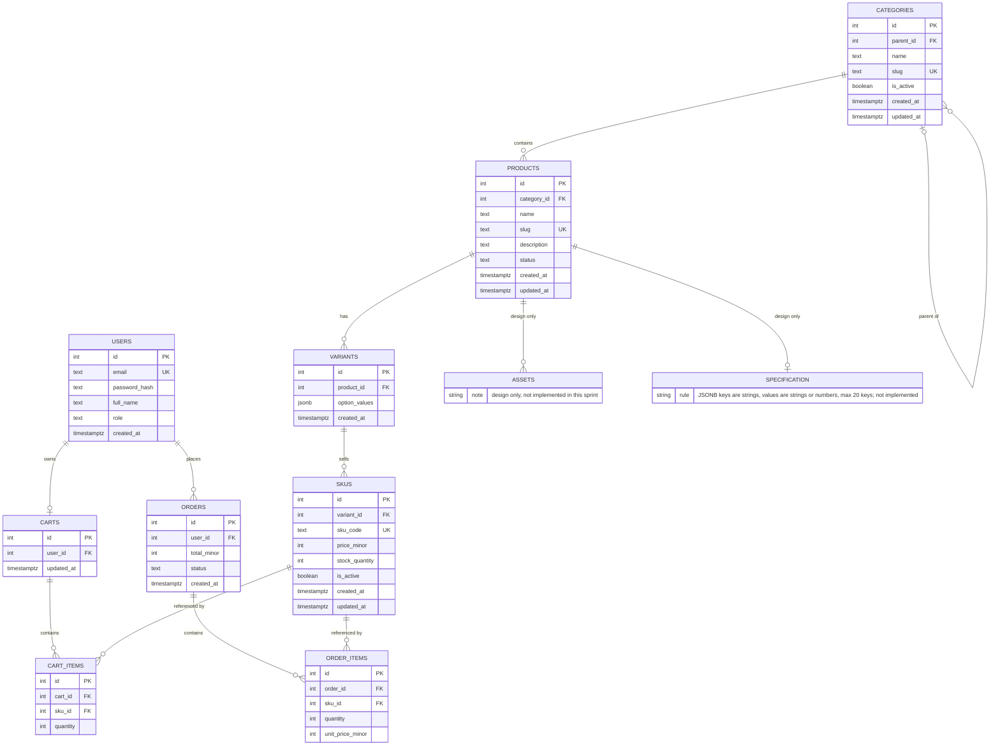

# E-Commerce Project Sprint 2: Catalog Data Foundation

This document describes the backend that is in the repository. Sprint 1 is the design record in [SPRINT_1.md](SPRINT_1.md). No Sprint 1 application code was present, so the migration creates the schema rather than altering earlier tables.

## 1. Sprint goal and scope boundary

Sprint 2 gives an apparel catalog a durable data foundation: categories, products, variants, and SKUs, with authenticated admin routes, migrations, seed data, tests, and this document.

In scope:

- Categories, products, variants, and SKUs
- Authenticated admin routes under `/api/v1/admin`
- Migrations, seed data, tests, and docs

Out of scope:

- Dynamic specification logic
- Asset upload or storage
- Public catalog search and public product endpoints
- Publication workflows beyond the status rule
- Payment, orders, shipping, cart endpoints, checkout, and any storefront UI

`carts`, `cart_items`, `orders`, and `order_items` exist only as schema. Assets and specifications are design-only: they appear here and are not created in the database or the API.

The stack is Node.js and Express in CommonJS, PostgreSQL through `pg`, raw SQL migrations with node-pg-migrate, validation with zod, auth with jsonwebtoken and bcrypt, and tests with jest and supertest. There is no ORM.

## 2. Sprint 1 decisions reused or changed

Reused from [SPRINT_1.md](SPRINT_1.md):

- Node.js and Express
- PostgreSQL
- bcrypt password hashes and JWT authentication
- The apparel domain (Men's Wear, Women's Wear, Footwear, and size/color variants)

Changed, and why:

- Size, color, and stock moved off `products`. A product is the style. A variant is one option combination, stored as `option_values` JSON. A SKU is the sellable row: code, price, and stock.
- `cart_items` and `order_items` reference `sku_id`. A line item has to point at the sellable row that carries the price, the stock, and the exact size/color combination.
- Money is an integer minor-unit column (`price_minor`, `total_minor`, `unit_price_minor`). Sprint 1 used decimal amounts. Integer minor units avoid binary floating-point money.
- `users.role` was added (`buyer` or `admin`, default `buyer`) so admin routes can tell an admin from a buyer. Sprint 1's user record had no role.

Sprint 1 also selected React with Vite and optional Redis. This sprint does not include a frontend, a cache, registration, or cart and order behavior.

## 3. Updated ERD and data dictionary

`ASSETS` and `SPECIFICATION` are design only, not implemented in this sprint. The written specification rule, which is not enforced in the schema or the API, is: a JSONB value on products whose keys are strings, whose values are strings or numbers, and which has at most 20 keys.



Identity columns are `INTEGER GENERATED BY DEFAULT AS IDENTITY`. Timestamps are `TIMESTAMPTZ NOT NULL DEFAULT now()`. `updated_at` on `categories`, `products`, `skus`, and `carts` is set to `now()` by the `set_updated_at` trigger on `UPDATE`.

### users

| Column | Type | Constraints | Notes |
|---|---|---|---|
| id | INTEGER | PK, identity | |
| email | TEXT | NOT NULL, UNIQUE | Login lookup |
| password_hash | TEXT | NOT NULL | bcrypt hash |
| full_name | TEXT | nullable | |
| role | TEXT | NOT NULL, DEFAULT `buyer`, CHECK `buyer` or `admin` | Re-read on each admin request |
| created_at | TIMESTAMPTZ | NOT NULL, DEFAULT now() | |

### categories

| Column | Type | Constraints | Notes |
|---|---|---|---|
| id | INTEGER | PK, identity | |
| parent_id | INTEGER | FK, nullable, CHECK `parent_id` is null or not equal to `id` | Self-parent is rejected by the database. Longer cycles are rejected by the API. |
| name | TEXT | NOT NULL | |
| slug | TEXT | NOT NULL, UNIQUE, CHECK lowercase, CHECK `^[a-z0-9]+(-[a-z0-9]+)*$` | Generated from the name when omitted |
| is_active | BOOLEAN | NOT NULL, DEFAULT true | Deactivating a parent also deactivates descendants |
| created_at | TIMESTAMPTZ | NOT NULL, DEFAULT now() | |
| updated_at | TIMESTAMPTZ | NOT NULL, DEFAULT now() | Trigger |

Index: `categories_parent_id_idx` on `parent_id`.

### products

| Column | Type | Constraints | Notes |
|---|---|---|---|
| id | INTEGER | PK, identity | |
| category_id | INTEGER | NOT NULL, FK | One category per product |
| name | TEXT | NOT NULL | |
| slug | TEXT | NOT NULL, UNIQUE, same lowercase and format CHECKs as categories | |
| description | TEXT | nullable | |
| status | TEXT | NOT NULL, DEFAULT `draft`, CHECK `draft`, `published`, or `archived` | Create always inserts `draft` |
| created_at | TIMESTAMPTZ | NOT NULL, DEFAULT now() | |
| updated_at | TIMESTAMPTZ | NOT NULL, DEFAULT now() | Trigger |

Index: `products_category_id_idx` on `category_id`.

There is no specification column.

### variants

| Column | Type | Constraints | Notes |
|---|---|---|---|
| id | INTEGER | PK, identity | |
| product_id | INTEGER | NOT NULL, FK | |
| option_values | JSONB | NOT NULL, CHECK `jsonb_typeof` is `object`, UNIQUE with `product_id` | Keys are trimmed, lowercased, and sorted before insert. Stored values are lowercase. |
| created_at | TIMESTAMPTZ | NOT NULL, DEFAULT now() | |

Index: `variants_product_id_idx` on `product_id`.

### skus

| Column | Type | Constraints | Notes |
|---|---|---|---|
| id | INTEGER | PK, identity | |
| variant_id | INTEGER | NOT NULL, FK | |
| sku_code | TEXT | NOT NULL, UNIQUE | API stores it uppercased. Pattern `^[A-Z0-9][A-Z0-9-]{1,63}$`. Immutable after create. |
| price_minor | INTEGER | NOT NULL, CHECK `>= 0` | Minor units. The response `price` string is display only. |
| stock_quantity | INTEGER | NOT NULL, DEFAULT 0, CHECK `>= 0` | `inStock` is `stock_quantity > 0` |
| is_active | BOOLEAN | NOT NULL, DEFAULT true | |
| created_at | TIMESTAMPTZ | NOT NULL, DEFAULT now() | |
| updated_at | TIMESTAMPTZ | NOT NULL, DEFAULT now() | Trigger |

Index: `skus_variant_id_idx` on `variant_id`.

### carts (schema only)

| Column | Type | Constraints | Notes |
|---|---|---|---|
| id | INTEGER | PK, identity | No routes |
| user_id | INTEGER | NOT NULL, UNIQUE, FK | One cart row per user |
| updated_at | TIMESTAMPTZ | NOT NULL, DEFAULT now() | Trigger |

### cart_items (schema only)

| Column | Type | Constraints | Notes |
|---|---|---|---|
| id | INTEGER | PK, identity | No routes |
| cart_id | INTEGER | NOT NULL, FK | |
| sku_id | INTEGER | NOT NULL, FK | |
| quantity | INTEGER | NOT NULL, CHECK `> 0` | UNIQUE (`cart_id`, `sku_id`) |

### orders (schema only)

| Column | Type | Constraints | Notes |
|---|---|---|---|
| id | INTEGER | PK, identity | No routes. `status` has no CHECK. |
| user_id | INTEGER | NOT NULL, FK | |
| total_minor | INTEGER | NOT NULL, CHECK `>= 0` | |
| status | TEXT | NOT NULL | |
| created_at | TIMESTAMPTZ | NOT NULL, DEFAULT now() | |

### order_items (schema only)

| Column | Type | Constraints | Notes |
|---|---|---|---|
| id | INTEGER | PK, identity | No routes |
| order_id | INTEGER | NOT NULL, FK | |
| sku_id | INTEGER | NOT NULL, FK | |
| quantity | INTEGER | NOT NULL, CHECK `> 0` | |
| unit_price_minor | INTEGER | NOT NULL, CHECK `>= 0` | Price copied onto the line |

### assets and specification

Design only, not implemented in this sprint. No `assets` table and no specification column exist. The written specification rule is a JSONB object on a product: keys are strings, values are strings or numbers, and there are at most 20 keys.

### Foreign keys

| Constraint | Column | References | ON DELETE | ON UPDATE |
|---|---|---|---|---|
| categories_parent_id_fkey | categories.parent_id | categories.id | RESTRICT | CASCADE |
| products_category_id_fkey | products.category_id | categories.id | RESTRICT | CASCADE |
| variants_product_id_fkey | variants.product_id | products.id | CASCADE | CASCADE |
| skus_variant_id_fkey | skus.variant_id | variants.id | CASCADE | CASCADE |
| carts_user_id_fkey | carts.user_id | users.id | CASCADE | CASCADE |
| cart_items_cart_id_fkey | cart_items.cart_id | carts.id | CASCADE | CASCADE |
| cart_items_sku_id_fkey | cart_items.sku_id | skus.id | RESTRICT | CASCADE |
| orders_user_id_fkey | orders.user_id | users.id | RESTRICT | CASCADE |
| order_items_order_id_fkey | order_items.order_id | orders.id | CASCADE | CASCADE |
| order_items_sku_id_fkey | order_items.sku_id | skus.id | RESTRICT | CASCADE |

## 4. Administration route table

Every `/api/v1/admin` route requires `Authorization: Bearer <token>`. `requireAuth` verifies the JWT and sets `req.user` to `{ id, role }`. `requireAdmin` then loads `users.role` for that id. Both middlewares are mounted once on the admin router. A missing, malformed, expired, or wrongly signed token is `401 UNAUTHENTICATED`. A buyer, or an admin who has been demoted in the database, is `403 FORBIDDEN`.

JSON field names in requests and responses are camelCase. Error bodies are `{ "error": { "code", "message" } }` and do not include a stack trace.

Two public routes also exist:

| Method | Path | Auth | Success |
|---|---|---|---|
| GET | `/health` | none | `200` `{ "status": "ok" }` |
| POST | `/api/v1/auth/login` | none | `200` `{ "token" }` |

Login body: `{ email, password }`. Unknown email and wrong password both return `401` with message `Invalid email or password`. The captured login response in [evidence/demo-output.md](evidence/demo-output.md) is `{ "token": "***REDACTED***" }`.

### POST `/api/v1/admin/categories`

| | |
|---|---|
| Body | `name` (required), `slug` (optional kebab-case), `parentId` (optional positive integer or null), `isActive` (optional boolean) |
| Success | `201` category: `id`, `name`, `slug`, `parentId`, `isActive`, `createdAt`, `updatedAt` |
| Errors | `400 VALIDATION_ERROR` (empty name, bad slug, name that slugifies to nothing). `404 PARENT_NOT_FOUND`. `409 DUPLICATE_SLUG`. |

```json
{ "name": "Summer Linen" }
```

```json
{ "id": 1, "name": "Summer Linen", "slug": "summer-linen", "parentId": null, "isActive": true, "createdAt": "2026-10-02T17:06:39.698Z", "updatedAt": "2026-10-02T17:06:39.698Z" }
```

### GET `/api/v1/admin/categories`

| | |
|---|---|
| Body | none |
| Success | `200` array of root categories. Each node has the category fields plus `children`. Ordered by name, then id. |
| Errors | auth only |

The full tree from the demo run, including the seeded Men's Wear, Women's Wear, and Footwear branches, is in [evidence/demo-output.md](evidence/demo-output.md).

### PATCH `/api/v1/admin/categories/:id`

| | |
|---|---|
| Body | at least one of `name`, `slug`, `parentId` (integer or null), `isActive` |
| Success | `200` category object |
| Errors | `400 VALIDATION_ERROR`, `400 CATEGORY_CYCLE`, `404 NOT_FOUND`, `404 PARENT_NOT_FOUND`, `409 DUPLICATE_SLUG` |

```json
{ "isActive": false }
```

Response `isActive` is `false`. Descendants are also set inactive in the same transaction. Sending `{ "isActive": true }` later sets only this row back to active.

There is no DELETE route. `DELETE /api/v1/admin/categories/:id` returns `404 NOT_FOUND` with message `Route not found`.

### POST `/api/v1/admin/products`

| | |
|---|---|
| Body | `name` (required), `categoryId` (required positive integer), `slug` (optional), `description` (optional string or null). `status` is accepted and ignored. |
| Success | `201` product. `status` is always `draft`. Includes `category` `{ id, name, slug }`, `variantCount`, `skuCount`, `activeSkuCount`, and `variants`. |
| Errors | `400 VALIDATION_ERROR` (`name`, `categoryId`, slug). `404 CATEGORY_NOT_FOUND`. `409 DUPLICATE_SLUG`. |

Captured create from the demo (ids from that run):

```json
{ "name": "Demo Field Jacket 1790960799517", "slug": "demo-field-jacket-1790960799517", "description": "Draft product created by the demonstration script.", "categoryId": 25 }
```

The response `status` was `draft`, with `variantCount`, `skuCount`, and `activeSkuCount` all `0`.

### GET `/api/v1/admin/products`

| | |
|---|---|
| Query | `status` (`draft`, `published`, `archived`), `categoryId`, `page` (default 1), `pageSize` (default 20, max 100) |
| Success | `200` `{ data, page, pageSize, total }`. Each product includes category, counts, and `variants`, and each variant includes its `skus` with `priceMinor`, `price`, `stockQuantity`, `inStock`, and `isActive`. |
| Errors | `400 VALIDATION_ERROR` for a bad status, page, or pageSize |

`GET /api/v1/admin/products?status=archived&page=1&pageSize=2` returns only archived products, with `page` 1 and `pageSize` 2. The unfiltered demo list is in [evidence/demo-output.md](evidence/demo-output.md).

### PATCH `/api/v1/admin/products/:id`

| | |
|---|---|
| Body | at least one of `name`, `slug`, `description`, `categoryId`, `status` (`draft`, `published`, `archived`) |
| Success | `200` product |
| Errors | `400 VALIDATION_ERROR`, `400 PRODUCT_NOT_PUBLISHABLE`, `404 NOT_FOUND`, `404 CATEGORY_NOT_FOUND`, `409 DUPLICATE_SLUG` |

`{ "status": "archived" }` returns the product with `status` `archived`. `{ "status": "published" }` returns `400 PRODUCT_NOT_PUBLISHABLE` when the category is inactive or the product has no active SKU. The message names the failed rule, for example `A product cannot be published because it has no active SKU`. When both fail, the two reasons are joined with ` and `.

There is no DELETE route. `DELETE /api/v1/admin/products/:id` returns `404 NOT_FOUND`.

### POST `/api/v1/admin/products/:id/variants`

| | |
|---|---|
| Body | `optionValues` object, 1 to 5 entries. Keys up to 40 characters, values up to 80, both non-empty after trim. |
| Success | `201` `{ id, productId, optionValues, createdAt, skus }` |
| Errors | `400 VALIDATION_ERROR`, `400 OPTION_KEY_MISMATCH`, `400 PRODUCT_ARCHIVED`, `404 NOT_FOUND`, `409 DUPLICATE_VARIANT` |

The first variant fixes the key set. A later variant with a different set of keys returns `400 OPTION_KEY_MISMATCH`. The same combination, including the same keys in another order or different letter case, returns `409 DUPLICATE_VARIANT`. Archived products return `400 PRODUCT_ARCHIVED`.

Demo request `{ "optionValues": { "color": "navy", "size": "m" } }` was stored as `{ "size": "m", "color": "navy" }` because keys are sorted and values are lowercased.

### GET `/api/v1/admin/products/:id/variants`

| | |
|---|---|
| Body | none |
| Success | `200` array of variants, each with its existing SKUs. Nothing is synthesized. |
| Errors | `404 NOT_FOUND` when the product does not exist |

A SKU with `stockQuantity` 0 is included, with `inStock` false.

### POST `/api/v1/admin/products/:id/skus`

| | |
|---|---|
| Body | `skuCode` (required), `priceMinor` (required integer `>= 0`), `stockQuantity` (optional integer `>= 0`, default 0), `isActive` (optional boolean, default true), and `variantId` and/or `optionValues` |
| Success | `201` SKU: `id`, `variantId`, `skuCode`, `priceMinor`, `price`, `stockQuantity`, `inStock`, `isActive`, `createdAt`, `updatedAt` |
| Errors | `400 VALIDATION_ERROR` (negative, float, or string money or stock), `400 VARIANT_NOT_FOUND`, `400 VARIANT_PRODUCT_MISMATCH`, `400 VARIANT_MISMATCH`, `400 VARIANT_REQUIRED`, `400 PRODUCT_ARCHIVED`, `404 NOT_FOUND`, `409 DUPLICATE_SKU` |

If both `variantId` and `optionValues` are omitted and the product has no variants, the API creates one variant with `optionValues` `{}` and attaches the SKU to it. If `optionValues` match no saved variant, the response is `400 VARIANT_NOT_FOUND` and no variant row is inserted. `skuCode` is trimmed and uppercased, so `tee-blk-s` collides with `TEE-BLK-S`.

Demo response for price `8900` and stock `3`:

```json
{ "priceMinor": 8900, "price": "$89.00", "stockQuantity": 3, "inStock": true, "isActive": true }
```

### PATCH `/api/v1/admin/skus/:id`

| | |
|---|---|
| Body | at least one of `priceMinor`, `stockQuantity`, `isActive`. `skuCode` is rejected. |
| Success | `200` SKU |
| Errors | `400 VALIDATION_ERROR`, `400 SKU_CODE_IMMUTABLE`, `404 NOT_FOUND`, `409 LAST_ACTIVE_SKU` |

`stockQuantity` replaces the stored quantity in one `UPDATE`. `{ "priceMinor": 2499, "stockQuantity": 7, "isActive": false }` returns those values and `inStock` true. `{ "skuCode": "TEE-NEW" }` returns `400 SKU_CODE_IMMUTABLE` and leaves the row unchanged. Setting `isActive` false on the only active SKU of a published product returns `409 LAST_ACTIVE_SKU` with message `Cannot deactivate the last active SKU of a published product`. The product stays `published` and the SKU stays active.

### Error codes

| Code | HTTP | When |
|---|---|---|
| VALIDATION_ERROR | 400 | Zod failure, empty generated slug, bad option values, negative or non-integer money or stock, Postgres `22P02` |
| CONSTRAINT_VIOLATION | 400 | Postgres `23514` |
| CATEGORY_CYCLE | 400 | New parent is the category or one of its descendants |
| OPTION_KEY_MISMATCH | 400 | Variant keys differ from the product's first variant |
| PRODUCT_ARCHIVED | 400 | Variant or default variant on an archived product |
| PRODUCT_NOT_PUBLISHABLE | 400 | Publish while the category is inactive or there is no active SKU |
| VARIANT_NOT_FOUND | 400 | Unknown variant id, or option values that match no variant |
| VARIANT_PRODUCT_MISMATCH | 400 | Variant belongs to another product |
| VARIANT_MISMATCH | 400 | `variantId` and `optionValues` disagree |
| VARIANT_REQUIRED | 400 | Product already has variants and both identifiers were omitted |
| SKU_CODE_IMMUTABLE | 400 | PATCH body includes `skuCode` |
| UNAUTHENTICATED | 401 | Missing or invalid token, or login failure |
| FORBIDDEN | 403 | Authenticated user is not an admin in the database |
| NOT_FOUND | 404 | Unknown route, category, product, or SKU |
| PARENT_NOT_FOUND | 404 | Category parent id does not exist |
| CATEGORY_NOT_FOUND | 404 | Product category id does not exist |
| DUPLICATE_SLUG | 409 | Unique slug violation (`23505` whose constraint name contains `slug`) |
| DUPLICATE_SKU | 409 | Unique `sku_code` violation |
| DUPLICATE_VARIANT | 409 | Unique `(product_id, option_values)` violation |
| DUPLICATE_VALUE | 409 | Any other unique violation |
| FOREIGN_KEY_VIOLATION | 409 | Postgres `23503` |
| LAST_ACTIVE_SKU | 409 | Deactivating the last active SKU of a published product |
| INTERNAL_ERROR | 500 | Unexpected error. The client message is `An unexpected error occurred`. |

## 5. Data integrity and authorization decisions

Database rules:

- UNIQUE: `users.email`, `categories.slug`, `products.slug`, `(variants.product_id, variants.option_values)`, `skus.sku_code`, `carts.user_id`, `(cart_items.cart_id, cart_items.sku_id)`
- CHECK: role, self-parent, slug case and shape, product status, JSON object for option values, non-negative money and stock, positive line quantities
- Foreign keys and the ON DELETE / ON UPDATE policies in the table above
- The API does not pre-check slug or SKU uniqueness. A `23505` from the insert is mapped by the constraint name.

API rules:

- Category cycles that go through a descendant. The database CHECK only rejects `parent_id = id`. Before a parent change, the service locks the category and runs a recursive CTE. If the new parent is in the category's descendant set, the response is `400 CATEGORY_CYCLE` and the parent is left unchanged.
- The same option-key set for every variant of a product (`OPTION_KEY_MISMATCH`)
- Normalized option JSON so key order and letter case cannot bypass the unique combination
- Publish requirements, and the refusal to deactivate the last active SKU of a published product
- SKU code immutability
- One default `{}` variant only when a SKU is created with neither `variantId` nor `optionValues` and the product has no variants

Cycles: a parent link such as Clothing, then Tops, then Shirts is allowed. Pointing Clothing at Shirts returns `400 CATEGORY_CYCLE`. Inserting a row whose `parent_id` equals its `id` fails in PostgreSQL with `23514` even if the API is bypassed.

401 versus 403: `requireAuth` returns `401 UNAUTHENTICATED` with message `Authentication required` when the header is missing, is `Bearer` with no token, uses another scheme, or the JWT is expired, signed with the wrong secret, or has a bad `sub` or `role`. `requireAdmin` runs only after that. It selects `role` from `users` for `req.user.id`. A missing user is `401`. A role other than `admin` is `403 FORBIDDEN` with message `Admin access required`. The role inside the token is not trusted for this decision.

Stock races: a stock change is one `UPDATE` that assigns `stock_quantity` to the submitted integer. The handler does not read the current quantity and add to it. Zod and the CHECK both reject a negative number. Two concurrent assignments therefore leave whichever non-negative value commits last. Publishing and last-SKU deactivation lock the product row with `SELECT ... FOR UPDATE` in the same transaction as the decision.

### Answers to the seven business-rule questions

1. A draft product with no SKU is allowed. `POST /products` inserts `status = 'draft'` even if the body says `published`, and it does not require a SKU. The seeded Everyday Sneakers row is `draft`, has one variant, and has no SKU. Publishing requires an active category and at least one SKU with `is_active = true`. A draft with no SKU that is patched to `published` stays `draft` and returns `400 PRODUCT_NOT_PUBLISHABLE`. Deactivating the last active SKU of a published product returns `409 LAST_ACTIVE_SKU`. The product remains `published`, so it is never left published with zero active SKUs.

2. A product has one canonical category because `products.category_id` is a single `NOT NULL` foreign key. The admin list and the publish check use that one category. A second category would make the tree and the publish rule ambiguous. An unknown id returns `404 CATEGORY_NOT_FOUND`. A draft or archived product may use an inactive category. Publishing that product returns `400 PRODUCT_NOT_PUBLISHABLE` and the message includes `its category is inactive`.

3. Deactivating a parent deactivates its descendants in the same transaction. For Clothing, then Tops, then Shirts, `PATCH` with `{ "isActive": false }` on Clothing sets all three `is_active` flags to false. `PATCH` with `{ "isActive": true }` sets only Clothing back to true. Tops and Shirts stay inactive.

4. An out-of-stock SKU stays in the response. Seeded `TEE-BLK-L` has `stock_quantity` 0 and `is_active` true. `GET /products/:id/variants` returns that SKU with `inStock: false`. `inStock` is `stockQuantity > 0`. The row is not filtered out.

5. Price lives on the SKU. Two SKUs may store the same `price_minor`: seeded `TEE-BLK-S` and `TEE-BLK-M` are both `1999`, and the API accepts that. A different price on another SKU of the same product is a different `priceMinor` (`TEE-WHT-S` is `2199`). The response field `price` (`$19.99`, `$21.99`) is formatted for display. Calculations use `priceMinor`.

6. Negative stock and negative price are rejected by zod (`400 VALIDATION_ERROR`) and, if SQL is run directly, by `CHECK (stock_quantity >= 0)` and `CHECK (price_minor >= 0)` (`23514`). Duplicate SKU codes are rejected by `UNIQUE (sku_code)`. The API uppercases the code first, so `tee-blk-s` and `TEE-BLK-S` collide as `409 DUPLICATE_SKU`. A raw second insert of the same `sku_code` fails with `23505`.

7. Archiving a product sets `products.status` to `archived`. It does not delete the product, its variants, or its SKUs, and it does not read or write `cart_items` or `order_items`. Those tables have no routes. If a line item already referenced the SKU, that `sku_id` would still point at the same row. `cart_items.sku_id` and `order_items.sku_id` use `ON DELETE RESTRICT`, so the database rejects deleting a SKU that a cart or order line still references.

## 6. Seed data and demonstration instructions

`npm run seed` runs `backend/src/db/seed.js`. It refuses to run when `NODE_ENV=production`. It reloads by deleting catalog, cart, and order rows inside one transaction, then inserting the demonstration again. That clear-and-reload keeps the missing White/L combination absent on a second run. It deletes every category, product, variant, SKU, cart, and order in the database named by `DATABASE_URL`, and it replaces only the two demo users.

Passwords are read from `SEED_ADMIN_PASSWORD` and `SEED_BUYER_PASSWORD`. Dev-only defaults are listed in `backend/.env.example`. The script hashes them with bcrypt and does not print them.

On a clean database the summary is:

```text
users: 2
categories: 6
products: 3
variants: 9
skus: 8
Intentionally missing combination: Classic Cotton Tee White/L
```

The second seed prints the same counts.

What is inserted:

- Users: `admin@example.com` (`admin`) and `buyer@example.com` (`buyer`)
- Categories: Men's Wear > T-Shirts, Men's Wear > Jeans, Women's Wear > Tops, Footwear
- Classic Cotton Tee, published, in T-Shirts. Variants Black/S, Black/M, Black/L, White/S, White/M. White/L is not inserted. It is not a zero-stock row.
- SKUs: `TEE-BLK-S` 1999 stock 12, `TEE-BLK-M` 1999 stock 8, `TEE-BLK-L` 1999 stock 0, `TEE-WHT-S` 2199 stock 5, `TEE-WHT-M` 2199 stock 4 and inactive
- Slim Fit Jeans, published, in Jeans. Variants blue/32, blue/34, and black/32, with SKUs `JEAN-BLU-32` (4999, stock 6), `JEAN-BLU-34` (4999, stock 4), and `JEAN-BLK-32` (5499, stock 3)
- Everyday Sneakers, draft, in Footwear. One variant, white / size 8, and no SKUs

From `backend`, against an empty database whose URL is `DATABASE_URL`:

```powershell
npm run migrate:up
npm run seed
npm run seed
npm run seed:verify
```

`npm run seed:verify` checks at least two category levels, at least three products, at least four SKUs, at least one product with two or more variants, and that Classic Cotton Tee has no White/L variant.

With the API already running (`npm run dev`), the demo script logs in as the seeded admin and writes Markdown. Tokens and passwords are printed as `***REDACTED***`. Authenticated steps show `Bearer ***REDACTED***`.

```powershell
npm run demo | Set-Content -Path ..\docs\evidence\demo-output.md -Encoding utf8
```

The saved run in [evidence/demo-output.md](evidence/demo-output.md) did the following. Names include a timestamp so the script can be run again.

| Step | Request | Status |
|---|---|---|
| Log in | `POST /api/v1/auth/login` | 200, token redacted |
| Create a category | `POST /api/v1/admin/categories` | 201 |
| Create a draft product | `POST /api/v1/admin/products` | 201, `status` `draft` |
| Create a variant | `POST /api/v1/admin/products/17/variants` | 201 |
| Create a SKU | `POST /api/v1/admin/products/17/skus` | 201, `priceMinor` 8900, `price` `$89.00` |
| Read categories, products, and variants | GET those routes | 200 |
| Duplicate category slug | same category body | 409 `DUPLICATE_SLUG` |
| Duplicate SKU code | same `skuCode` | 409 `DUPLICATE_SKU` |
| No token | `GET /api/v1/admin/products` | 401 `UNAUTHENTICATED` |

Duplicate slug response:

```json
{ "error": { "code": "DUPLICATE_SLUG", "message": "Slug already exists" } }
```

Duplicate SKU response:

```json
{ "error": { "code": "DUPLICATE_SKU", "message": "SKU code already exists" } }
```

Unauthenticated response:

```json
{ "error": { "code": "UNAUTHENTICATED", "message": "Authentication required" } }
```

## 7. Test strategy, command and result

Tests use jest and supertest. `TEST_DATABASE_URL` must be set and must name a different database from `DATABASE_URL`; otherwise the run aborts before it connects. Global setup drops and recreates the `public` schema on the test database and runs the migrations. `resetDb()` truncates the catalog and user tables with `RESTART IDENTITY CASCADE` before each test file that uses the real pool. Files that mock the pool skip that truncate. Jest runs files one at a time (`--runInBand`) with a 20 second timeout, and the pool is closed after the run.

Command, from `backend`:

```powershell
npm test
```

That script is `jest --runInBand`. The last full run:

```text
Test Suites: 8 passed, 8 total
Tests:       80 passed, 80 total
Snapshots:   0 total
Time:        6.697 s
Ran all test suites.
```

| Business rule | Failure-path test |
|---|---|
| 1. Published product must have an active category and an active SKU | `rejects publishing a product with no active SKU` and `rejects publishing a product whose category is inactive` in `tests/products.test.js`. `rejects deactivating the last active SKU of a published product and leaves it published` in `tests/variants-skus.test.js`. |
| 2. One canonical category | `rejects an unknown categoryId` in `tests/products.test.js` |
| 3. Deactivating a parent deactivates descendants, and reactivation does not restore them | `deactivating a parent deactivates its descendants and reactivation leaves them inactive` in `tests/categories.test.js` |
| 4. Out-of-stock SKU is still returned | `returns a SKU whose stock is zero with inStock false` in `tests/variants-skus.test.js`. Negative stock, the invalid form of this quantity, is `rejects negative priceMinor and negative stockQuantity`. |
| 5. Shared price, and a different price per SKU | `accepts two SKUs with the same price` in `tests/variants-skus.test.js`. A non-integer price is rejected by `rejects floating point and string prices`. |
| 6. No negative stock and no duplicate SKU code | `rejects negative priceMinor and negative stockQuantity`, `the database CHECK rejects a negative price and a negative stock inserted via raw SQL`, and `rejects a duplicate SKU code, including different casing of the same code` in `tests/variants-skus.test.js` |
| 7. Archived product and a later cart or order line | No API test. Cart and order tables have no routes. The schema rule is `ON DELETE RESTRICT` on `cart_items.sku_id` and `order_items.sku_id`. |

Related failure tests that are not one of the seven rules: duplicate category and product slugs (`409 DUPLICATE_SLUG`), a category cycle (`400 CATEGORY_CYCLE`), a self-parent insert (`23514`), a duplicate variant (`409 DUPLICATE_VARIANT`), a SKU for an unknown combination that creates no variant, an archived product rejecting a new variant, and every admin route rejecting a missing token (`401`) and a buyer (`403`) in `tests/authorization.test.js`.

## 8. Known limitations

- There is no registration route. The only auth route is login.
- Option values are stored lowercased. The original display capitalization is not kept.
- A cycle through a descendant is prevented by the API. The database CHECK only forbids a category being its own parent.
- Stock PATCH replaces the quantity. It is not an increment. Concurrent updates keep the last committed non-negative value.
- The last active SKU of a published product cannot be deactivated. The product is not moved back to `draft`.
- Archive and deactivate are the only soft-delete actions. There is no workflow beyond the publish check.
- `orders.status` has no allowed-value CHECK.
- Cart and order tables are unused by the application. Archiving a product does not update them, because nothing in this sprint writes them.
- Assets and the specification JSONB rule are documented only. They are not tables, columns, or validation code.
- The seed deletes all catalog, cart, and order rows in the target database before inserting the demonstration.
- The demo script creates an extra category, product, variant, and SKU on each run and does not remove them.
- `GET /health` does not check the database. The smoke test checks the database with a separate query.
